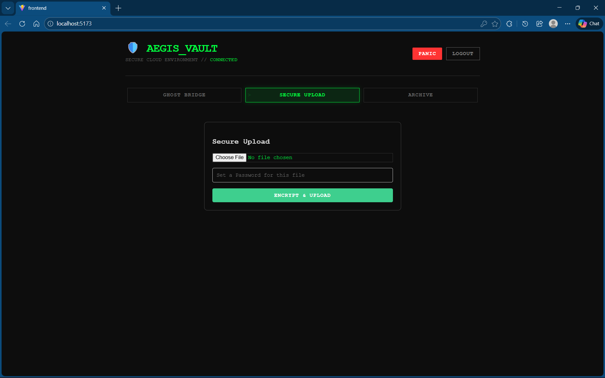
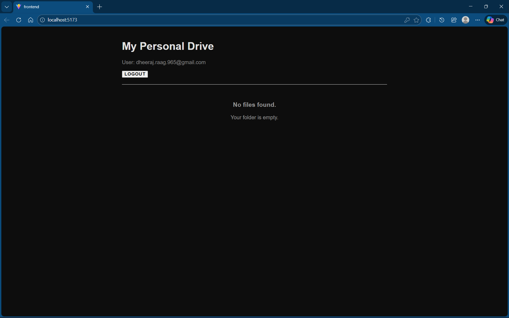

# Aegis Vault: Zero-Knowledge Cloud Infrastructure

> A secure, cross-device data synchronization ecosystem featuring Client-Side Encryption, Real-Time Websockets, and Agentic AI context awareness.

## Overview

Aegis Vault is a **Zero-Knowledge Cloud Storage** solution designed to solve the privacy risks of modern cloud providers. Unlike traditional storage (Google Drive/Dropbox), Aegis Vault encrypts all data **on the client device** before it ever touches the network.

It includes **"Ghost Bridge,"** a real-time encrypted clipboard that allows users to instantly transfer sensitive data (OTPs, passwords) between devices using Websockets, monitored by a local AI agent for context awareness.

## Key Features

### 1. Zero-Knowledge Vault (Storage)

- **Client-Side Encryption:** Files are encrypted using **AES-GCM (256-bit)** via the Web Crypto API.
- **Privacy First:** The server (Supabase) only stores encrypted binary blobs. Even the database administrator cannot read user files.
- **Secure Retrieval:** Decryption happens strictly in the browser using the user's ephemeral session key.

### 2. Ghost Bridge (Real-Time Sync)

- **Instant Clipboard:** Copy text on one device, paste it on another instantly.
- **End-to-End Encrypted:** Text payloads are encrypted before transmission.
- **Agentic AI Watcher:** A local heuristic agent detects sensitive patterns (like OTPs) in decrypted streams and auto-copies them to the clipboard.

### 3. Panic Protocol (Stealth Mode)

- **Duress Protection:** A dedicated "Panic Button" instantly unmounts all sensitive components.
- **Plausible Deniability:** The app transforms into a "Empty Drive" state, mimicking a fresh account to mislead attackers.

## Architecture

The system utilizes a **Hybrid Cloud Architecture**:

- **Frontend:** React (Vite) + TypeScript.
- **Auth & Database:** Supabase (PostgreSQL) for metadata and identity management.
- **Object Storage:** Supabase Storage (AWS S3 compatible) for encrypted blobs.
- **Real-Time Layer:** Supabase Realtime (Websockets) for the Ghost Bridge.

## Installation & Setup

### Prerequisites

- Node.js (v18+)
- A Supabase Account (Free Tier)

### Steps

1. **Clone the repository**
   ```bash
   git clone https://github.com/rdheeraj965/aegis-vault.git
   cd aegis-vault
   ```
2. **Install Dependencies**

   ```bash
   npm install
   ```

3. **Configure Supabase**

- Create a new project on Supabase.
- Run the SQL setup script (found in docs/setup.sql) to create the files and clips tables with Row Level Security (RLS).
- Create a storage bucket named vault.

4. **Environment Keys**

Open src/supabaseClient.ts and update your Project URL and Anon Key.

5. **Run the App**

```bash
npm run dev
```

### Screenshots

### The Dashboard (Cyberpunk Theme)



### Ghost Bridge (Real-Time Sync)


### Panic Mode (Stealth View)



### Disclaimer

This project is for educational purposes to demonstrate Cloud Security Architecture. While it uses military-grade standard algorithms (AES-GCM), it has not undergone a professional security audit.
